React Story Book 101
===========


[TOC]


## Instalación y configuración

La instalación es muy sencilla con npm, como un módulo global.

```app
$ npm i -g getstorybook
$ cd my-react-
$ getstorybook
```

Al ejecutar **getstorybook** dentro de un proyecto de react, se modificará el *package.json* agregando los scripts de storybook ademas de crear las carpetas de configuración(.storybook) y de historias(stories).

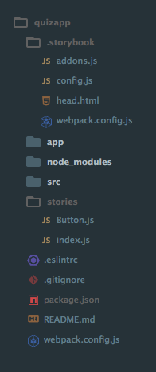

## Storybook server

Para ejectuar el servidor de storybook basta con ejecutar `npm run storybook`. Podemos especificar distintos parámetros para el servidor de storybook en otro script de npm o sobreescribirlo, por ejemplo, para cargar un directorio con archivos estáticos:

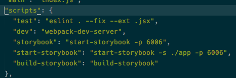

Están son otras opciones disponibles para los scripts/cli *start* y *build* de storybook

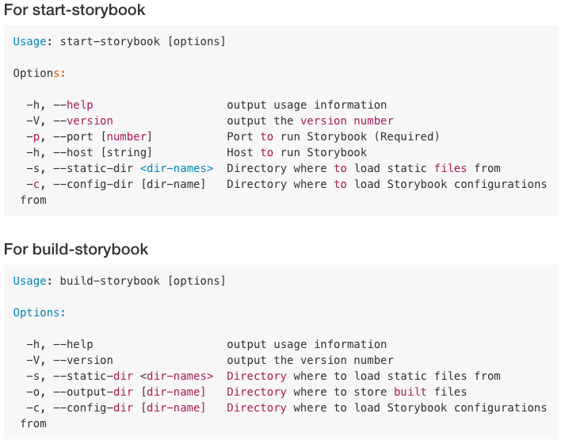

Especificar un directorio de salida es bastante útil si se quiere mostrar el storybook a otras personas, ya que genera los archivos estáticos y es fácil montarlos en github pages o similar.

## < head >< /head >

Sí se requieren scripts extras dentro de  **< head >** basta con incluir un archivo **header.html** dentro del directorio de configuración de storybook con los scripts, librerías y configuraciones necesarias.


## Historias

Las *historias de* cada componente, permiten visualizar un componente bajo distintas propiedades o configuraciones, facilitando la tarea de configurar y probrar nuestra librería de componentes.

Agregar historias de componentes es bastante sencillo:

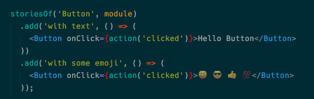
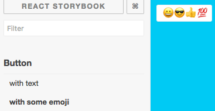

###  Decorators

Los *decorators* permiten envolver nuestros componentes a conveniencia, y es muy fácil utilizarlos:

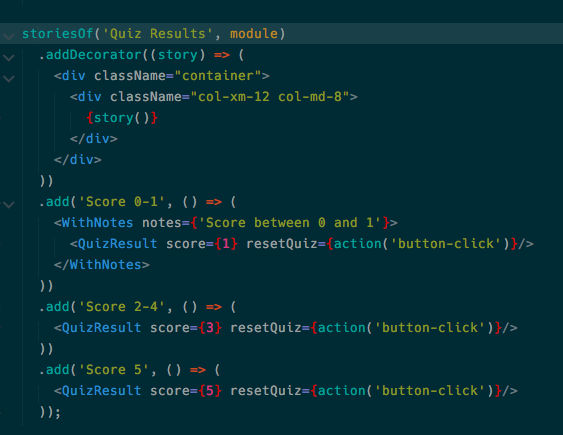
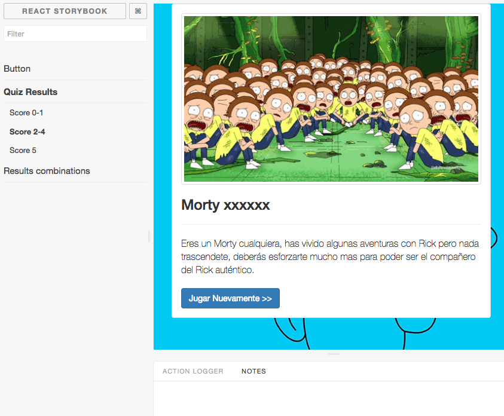

## Addons

### Notas

Storybook provee de una API para agregar nuevas funciones. Una de estas visible en el código de decorators es el [addon de notas](https://github.com/storybooks/storybook-addon-notes), un sencillo addon que permite agregar notas a cada historia.

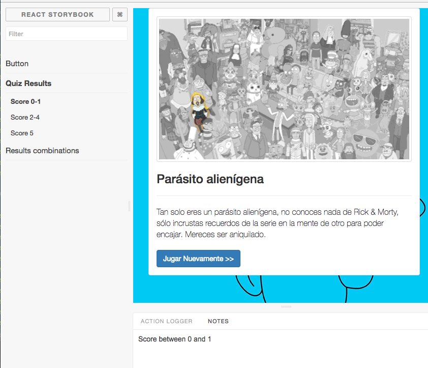

### Action Logger

Algunos componentes vienen incluidos en el modulo de storybook, como es el caso de action logger, que simplemente loggea acciones del usuario.

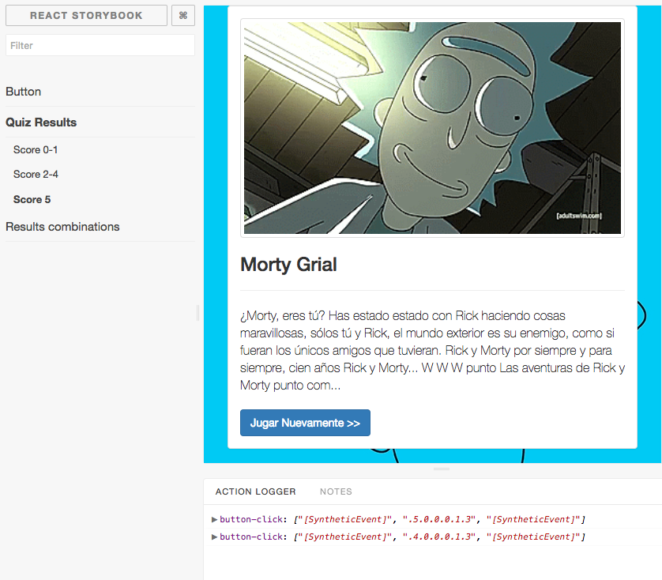

### Properties Combinations

[Este addon](https://github.com/evgenykochetkov/react-storybook-addon-props-combinations) evita escribir código repetitivamente, y genera los componentes con las combinaciones de propiedades especificadas, con una simple configuración.

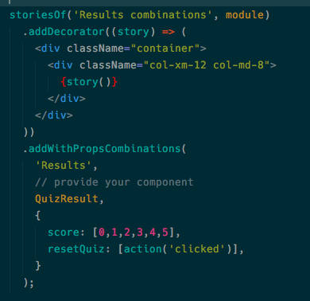
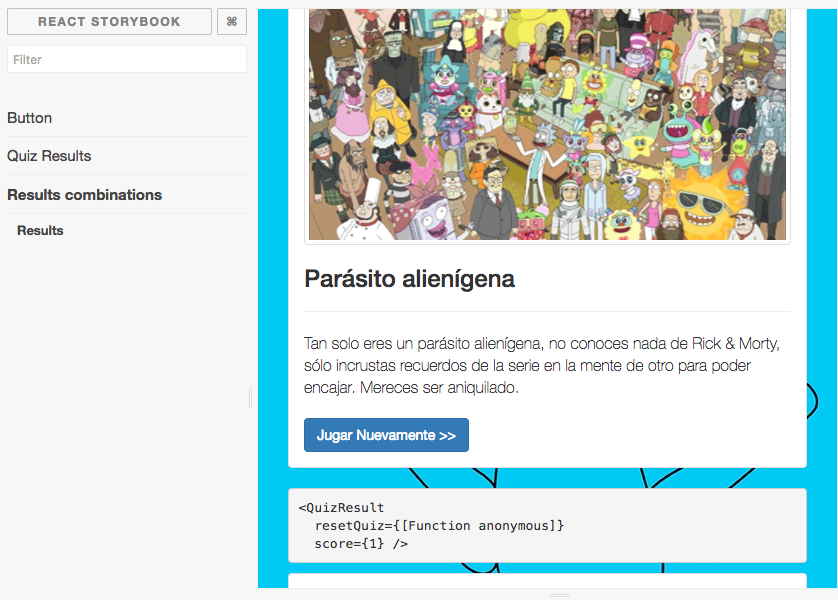

## Tests

Storybook tambien permite hacer pruebas estructurales, de interacción, CSS/estilos con Enzyme o Jest, pero eso estoy por probarlo...

To be continued >>